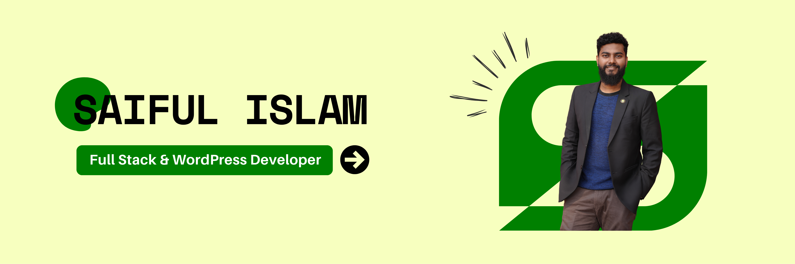

  

# Hi, I'm Saiful Islam

### Full Stack Developer • WordPress & eCommerce Expert • Web Enthusiast

I’m a web developer focused on building **clean, responsive, user-friendly web experiences**.

My journey started with WordPress and eCommerce development, and I’m now expanding my skills into modern JavaScript-based development with **TypeScript, React, and Next.js**.

I enjoy turning ideas into practical digital products, improving website performance, and continuously learning better ways to build for the web.

---

## 🚀 What I Do

* 💻 Build responsive and modern websites
* ⚡ Develop React & Next.js applications
* 🛒 Build and customize WordPress & WooCommerce websites
* 🎨 Create clean, user-focused UI
* 🚀 Optimize WordPress websites for performance & Core Web Vitals
* 🔧 Work with HTML, CSS, JavaScript & TypeScript
* 🔐 Explore web security and cybersecurity
* 📚 Continuously learn and build real-world projects

---
## 🛠️ Tech Stack  

### **Frontend**

### **Backend**

### **Tools & Others**

###  **CMS Tools**

## 🎯 Currently focusing on:

* **Next.js & TypeScript**
* React component architecture
* API integration & CRUD
* State management
* Responsive UI development
* Modern frontend development practices
* Building and deploying real-world projects

---
## 💡 Areas of Interest

- Web Application Development
- Interactive UI design
- WordPress & eCommerce
- AI & Automation
- Web Performance
- Exploring Tech
---

## 📌 What I'm Working Towards

I’m working toward becoming a stronger **modern web developer** by combining my existing WordPress and eCommerce experience with a deeper understanding of the JavaScript ecosystem.

My goal is to build applications that are not only visually clean, but also **performant, maintainable, accessible and practical**.

---

  <i>Building. Learning. Improving.</i>

